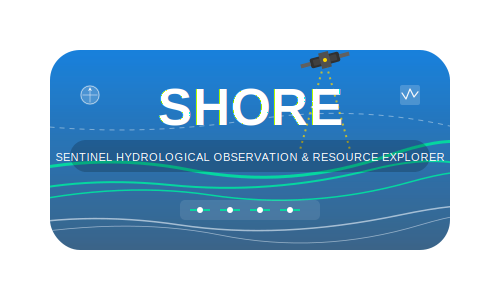

# SHORE - Sentinel Hydrological Observation & Resource Explorer

  

## Overview

SHORE (Sentinel Hydrological Observation & Resource Explorer) is a web application for visualizing and analyzing Sentinel satellite imagery with a focus on hydrological observations. It provides an intuitive interface for searching, viewing, and downloading Sentinel-2 satellite imagery, with integrated water level data from DMI (Danish Meteorological Institute).

## Live Demo
The application is deployed and accessible at: https://satshore-7a13ebe87a52.herokuapp.com/
## Features

- **Interactive Map Interface**: Draw areas of interest directly on the map
- **Advanced Search**: Filter Sentinel-2 images by date range and cloud coverage
- **Water Level Integration**: View water level data from nearby DMI stations for each satellite image
- **Image Preview**: Instantly visualize search results with image previews
- **Detailed Metadata**: Access comprehensive metadata for each image
- **Download Options**: Easy access to download different bands and assets

## Technology

SHORE is built with:

- **Python Flask**: Backend web framework
- **Leaflet.js**: Interactive mapping library
- **Bootstrap**: Responsive UI components
- **Copernicus STAC API**: For accessing Sentinel satellite data
- **DMI API**: For water level information from oceanic stations

## About Sentinel-2

Sentinel-2 is an Earth observation mission from the Copernicus Programme that systematically acquires optical imagery at high spatial resolution over land and coastal waters. The mission is a constellation with two twin satellites in the same orbit.

Key characteristics:
- **Multi-spectral data**: 13 spectral bands
- **High revisit time**: Every 5 days at the equator
- **High resolution**: Down to 10m spatial resolution
- **Wide coverage**: 290km swath width

Sentinel-2 data is particularly valuable for monitoring:
- Vegetation changes
- Coastal and inland waters
- Land use changes
- Disaster mapping

## Contact

For more information about this project, please contact the repository owner.